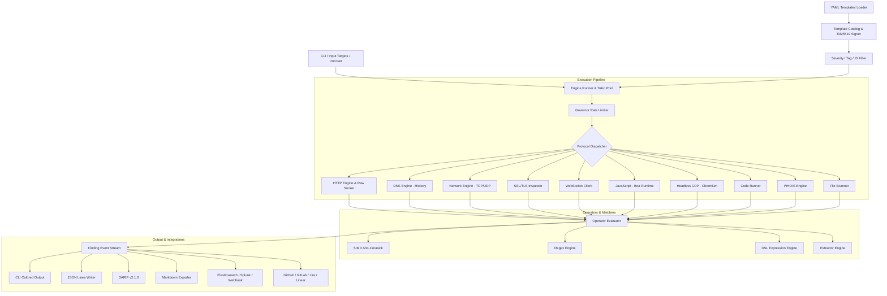

`nuclei-run` is built from the ground up to achieve maximum throughput, deterministic latency, and memory safety without garbage collection pauses.

---

## High-Level Architecture

---

## Core Subsystems

### 1. Tokio Async Work-Stealing Runtime
- All protocol requests run within non-blocking Tokio async tasks.
- Target URLs and templates are distributed across worker tasks dynamically without lock contention.
- Work is bounded by `--concurrency` (default: 25 workers).

### 2. Token-Bucket Rate Limiter (`governor`)
- Global request throttling enforced across all concurrent tasks using a lock-free token-bucket algorithm.
- Supports fractional refills to prevent traffic bursting on fragile endpoints.

### 3. SIMD Pattern Matching (`aho-corasick`)
- Word matchers utilize vectorized SIMD scanning (AVX2 on x86_64, NEON on ARM64).
- Matches multiple search keywords across multi-megabyte response payloads in a single memory pass.

### 4. Zero False-Positive Parity Design
- Strict separation of protocol interaction state.
- `interactsh_*` matcher parts only match against recorded Out-Of-Band interaction events, never against regular response bodies.
- Flow templates support boolean short-circuit evaluation, skipping false matches when prerequisites fail.

### 5. Memory Management & Zero-Copy Buffers
- HTTP responses and template match buffers use reference-counted slices (`Arc<[u8]>` / `&str`).
- No heap reallocation for intermediate matching passes.
