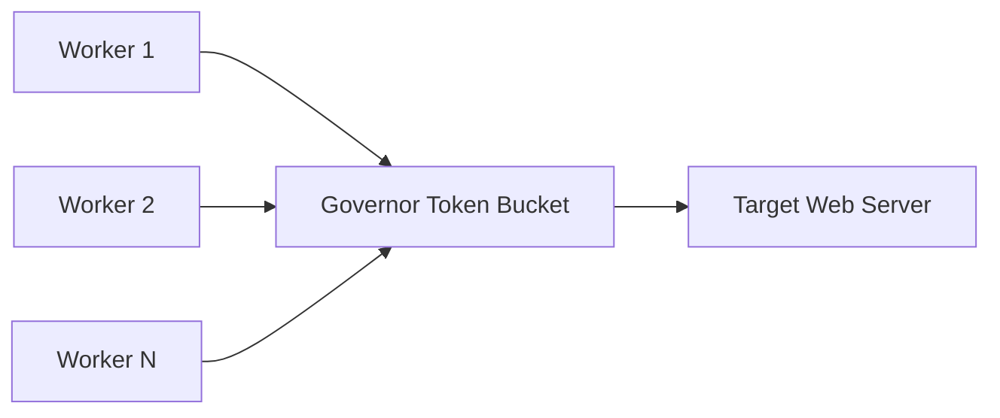

Learn how to configure network settings, tune concurrency parameters, manage rate limits, and optimize resource usage for different scanning profiles.

---

## Concurrency vs. Rate Limiting

Understanding the difference between concurrency and rate limiting is essential for stable scanning:

- **Concurrency (`-c`, `--concurrency`)**: The number of asynchronous worker tasks spawned in parallel. Higher values improve I/O saturation on high-latency targets.
- **Rate Limit (`-r`, `--rate-limit`)**: The absolute maximum number of network requests permitted per second globally across all workers.



### Recommended Profiles

| Profile | Concurrency (`-c`) | Rate Limit (`-r`) | Use Case |
| :--- | :--- | :--- | :--- |
| **Stealth / Fragile** | `5` | `10` | Embedded devices, fragile staging servers, rate-sensitive APIs. |
| **Standard (Default)** | `25` | `150` | Production web applications, routine bug bounty scans. |
| **Aggressive CI / Internal** | `100` | `1000` | Local network, Docker/Kubernetes clusters, fast local infrastructure. |
| **Unbounded Local** | `250` | `0` (unlimited) | Localhost benchmarks and staging stress tests. |

---

## Network Timeouts and Retries

Configure request resilience using the following flags:

```bash
nuclei-run -u https://slow-target.com -t ./templates/ \
  --timeout 15 \
  --retries 2 \
  --max-redirects 5
```

- `--timeout 15`: Wait up to 15 seconds per request before timing out.
- `--retries 2`: Retry failed network connections up to 2 times before marking as failed.
- `--max-redirects 5`: Cap redirect loops to 5 hops.

---

## Host Circuit Breaker (`--max-host-error`)

To prevent wasting time on dead hosts or triggering server rate limits:

```bash
nuclei-run -l targets.txt -t ./templates/ --max-host-error 20
```

If a host generates 20 consecutive connection failures or 5xx server errors, `nuclei-run` marks the host as down, drops all remaining templates for that host, and proceeds immediately to the next target.

---

## Honeypot Detection & Suppression

Defensive honeypots often return matching strings for all payloads, causing hundreds of false positive findings. Enable honeypot protection:

```bash
nuclei-run -l targets.txt -t ./templates/ \
  --honeypot-detect \
  --honeypot-threshold 15 \
  --suppress-honeypot
```

- When a single host triggers 15 or more distinct template IDs, `nuclei-run` flags the target as a potential honeypot.
- With `--suppress-honeypot`, all findings from that target are filtered out from reports.
