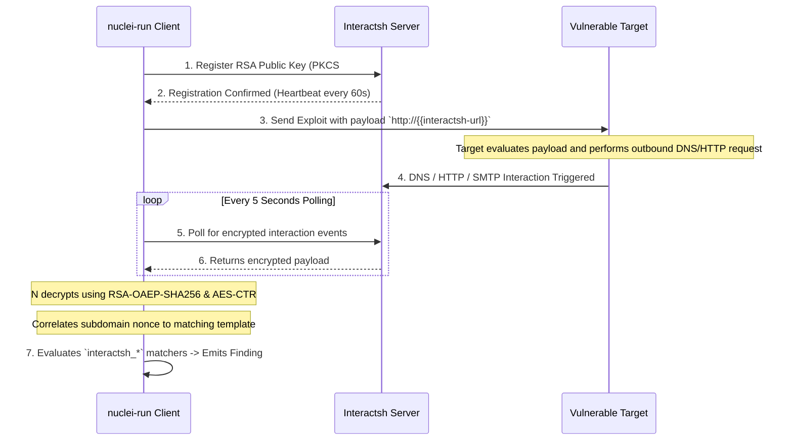

The **Interactsh** integration enables detection of blind vulnerabilities (such as blind SSRF, blind RCE, blind XXE, and DNS log4j injections) where the target server does not return output in its HTTP response but instead generates external network traffic.

---

## How Interactsh Works in `nuclei-run`

`nuclei-run` features a full native implementation of the Interactsh client protocol:



---

## Example: Blind SSRF with Interactsh

```yaml
id: blind-ssrf-webhook-test

info:
  name: Blind Out-of-Band SSRF Detection
  author: security-researcher
  severity: high
  tags: ssrf,blind,oob

http:
  - method: POST
    path:
      - "{{BaseURL}}/api/subscribe"
    headers:
      Content-Type: application/json
    body: '{"webhook_url":"http://{{interactsh-url}}"}'

    matchers-condition: and
    matchers:
      - type: word
        part: interactsh_protocol # Asserts that an actual OOB interaction arrived
        words:
          - "http"
          - "dns"
        condition: or
```

---

## Zero False-Positive Guarantee

In `nuclei-run`, matcher parts starting with `interactsh_` (`interactsh_protocol`, `interactsh_request`, `interactsh_response`) **only** resolve against real, decrypted interaction data from the Interactsh server. If no interaction was recorded, they evaluate strictly to `false` and can never accidentally match strings in the target's regular HTTP response body.

---

## Custom Self-Hosted Interactsh Server

To use your own self-hosted Interactsh server instance:

```bash
nuclei-run -u https://target.com -t ./templates/ --interactsh-server oob.mycorp.internal
```
