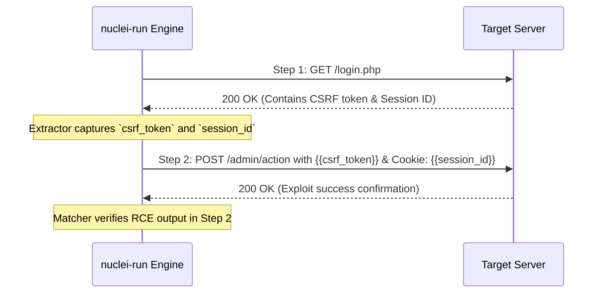

Request chaining allows a template to execute multi-step exploit flows, capturing session tokens, CSRF nonces, or dynamic identifiers in step $N$ and injecting them into step $N+1$.

---

## How Request Chaining Works

When an extractor is defined in an HTTP step, `nuclei-run` stores the extracted value in the request execution context under the extractor's `name`. Subsequent requests can reference it using `{{name}}`.



---

## Example: CSRF Token Extraction and Exploitation

```yaml
id: csrf-token-chaining-exploit

info:
  name: Multi-Step Admin Password Reset
  author: security-researcher
  severity: critical

http:
  # Step 1: Grab CSRF token and set session cookie
  - method: GET
    path:
      - "{{BaseURL}}/admin/settings"
    
    extractors:
      - type: regex
        name: csrf_token
        internal: true # Internal: do not emit finding for step 1
        part: body
        group: 1
        regex:
          - '<input type="hidden" name="token" value="([a-zA-Z0-9_-]+)">'

  # Step 2: Submit exploit payload using the extracted token
  - method: POST
    path:
      - "{{BaseURL}}/admin/settings/update"
    headers:
      Content-Type: application/x-www-form-urlencoded
    body: "token={{csrf_token}}&role=superadmin&action=grant"

    matchers-condition: and
    matchers:
      - type: status
        status:
          - 200

      - type: word
        words:
          - "Role updated successfully"
          - "Privilege level: superadmin"
        condition: and
```

---

## Dynamic Built-in Variables

In addition to custom extractors, the following built-in variables are always populated by `nuclei-run`:

- `{{BaseURL}}` — The base target URL (e.g., `https://example.com:8443`).
- `{{RootURL}}` — The root scheme and host (e.g., `https://example.com`).
- `{{Hostname}}` — Host and port without scheme (e.g., `example.com:8443`).
- `{{Host}}` — Target domain or IP without port (e.g., `example.com`).
- `{{Port}}` — Target port (e.g., `8443` or `443`).
- `{{Path}}` — Path segment of the target URL.
- `{{Scheme}}` — Target scheme (`http` or `https`).
